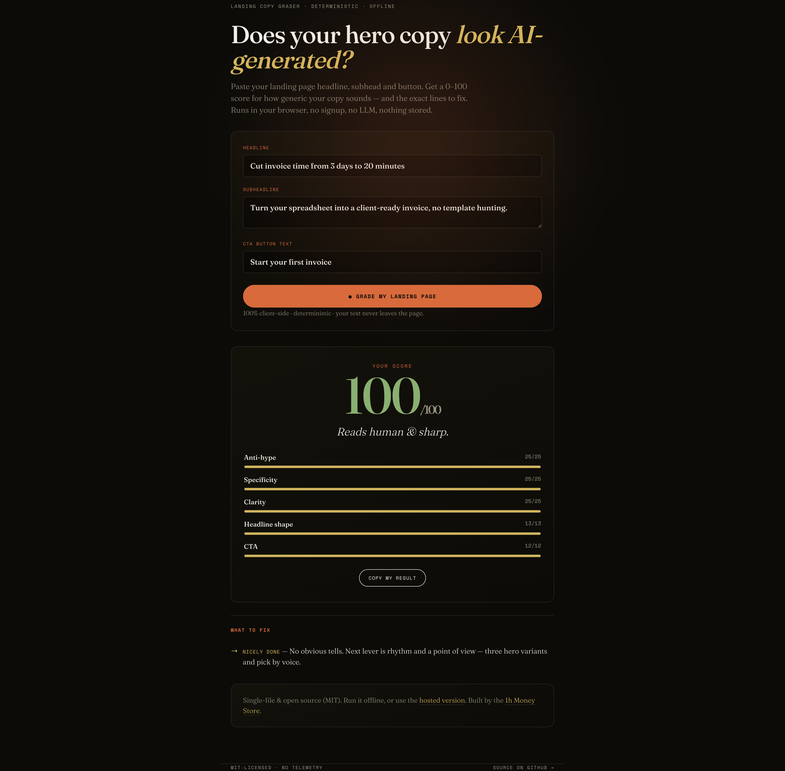

# Landing Copy Grader

[](https://doi.org/10.5281/zenodo.21543774)

**Does your landing page hero copy read as AI-generated?** Paste your headline, subheadline and CTA, get a **0–100 score** plus the exact lines to fix.

No LLM. No backend. No signup. One HTML file, ~15 KB, runs entirely in your browser — open it from `file://` on a plane if you want. Your text never leaves the page.

**[▶ Try it in the browser](https://parweb.github.io/landing-copy-grader/)** · [hosted version](https://1h-money-store.vercel.app/grader?utm_source=github&utm_medium=repo) · or download [`grader.html`](grader.html) and double-click it.

```bash
node scripts/score-page.js https://stripe.com
# headline: Financial infrastructure to grow your revenue. …
# subhead : Flexible solutions for every business model.
# cta     : Get started
# score   : 61/100 — Decent, but softening in places.  [filler,weakcta,nonum,longhl]
```

The repo also ships the **dataset that came out of it**: the hero copy of [239 real landing pages](data/landing-pages-scores.csv), extracted and scored with the grader in this repo, under the rules of that date. The headline finding — **195 of the 239 pages (82%) contain no number at all in their hero.** Median score 79. `node scripts/verify-dataset.js` re-scores all 239 rows offline and fails if a single one disagrees.



---

## Why deterministic instead of an LLM?

The obvious way to build a "does this sound AI-written?" tool is to ask an LLM. For this specific job, a fixed rule set is the better engineering choice:

| | Deterministic (this tool) | LLM call |
|---|---|---|
| **Same input → same score** | Always | No — non-deterministic, drifts across model versions |
| **Latency** | Instant, local | Network round-trip |
| **Cost / key** | Free, no API key | Per-call cost, key management |
| **Privacy** | Text never leaves the browser | Text sent to a third party |
| **Explainable** | You can read the exact rule that fired | Opaque; may hallucinate its reasoning |
| **Offline** | Yes | No |

There's an irony worth stating plainly: asking one language model whether copy "sounds like a language model" is circular. The tells that make copy read as generated — hype verbs, zero specifics, filler nouns, weak CTAs — are **surface, countable patterns**. You don't need a 100B-parameter model to count them; you need a good list and a scoring rubric. That's what this is.

### Honest limitations

This is a **linter for copy, not a ground-truth AI detector.** It scores *stylistic tells*, not authorship. Human copywriters write hype too, and a careful LLM can score 100. Treat the number as a fast heuristic — "here are the generic patterns in your text" — not a verdict on who or what wrote it. It's English-only and tuned for short hero copy (headline / subhead / CTA), not long-form.

## The heuristics

Five weighted dimensions sum to 100. Every rule is a plain function over the three input strings — read the whole thing in [`grader.html`](grader.html) (the scoring lives in one `grade()` function, ~40 lines).

**1. Anti-hype — 25 pts.** Starts at 25, subtracts penalties for the top "generated" tells:
- hype words (`revolutionize`, `unlock`, `seamless`, `leverage`, `supercharge`, `cutting-edge`, `game-changer`, … ~40 terms) — **−7 each**
- exclamation marks — **−5 each**
- emoji — **−4 each**. Arrows (`→`, `➜`) and check marks (`✓`) are **not** counted: a button arrow is typography, not an emoji.
- shouting — **−4 each**. A word in caps counts only if it is 6 letters or longer, or one of 17 words people genuinely shout in a headline (`FREE`, `NEW`, `SALE`, …). **`SQL`, `MCP`, `CLI`, `API` are acronyms, not shouting.**

**2. Specificity — 25 pts.** A concrete number → 25. No number → 8, with a partial rescue (+9) if there's a proof-shaped word (`%`, `x`, `hours`, `days`, `minutes`, `no`, `zero`). One concrete figure is the single fastest believability lift.

A digit only counts as a claim if it isn't part of a **name, a version, a year or a list index** — `Auth0`, `Mem0`, `n8n.io`, `Framer 3.0`, `B2C`, `© 2026` and a page quoting `pt-4` are not making a quantified claim.

**3. Clarity — 25 pts.** Starts at 25, **−6 per filler word** (`solutions`, `platform`, `powerful`, `amazing`, `experience`, `journey`, `ecosystem`, `all-in-one`, … ~27 terms). These add length, not meaning.

**4. Headline shape — 13 pts.** Rewards a repeatable length. 3–10 words → 13; 11–12 → 9; >12 → 5; <3 → 7; empty → 0.

**5. CTA — 12 pts.** A specific action → 12. A generic CTA (`submit`, `learn more`, `get started`, `sign up`, `click here`, … ~14 terms) → 4. Empty → 0.

Word matching is whole-word and case-insensitive (regex-bounded, so `learn` inside `learned` doesn't false-positive).

Then a verdict band: **≥80** reads human & sharp · **60–79** decent · **40–59** somewhat generic · **<40** reads AI-generated. You get up to six targeted fixes, each naming the exact count it found.

> **The three exclusions above are corrections, dated 2026-07-25**, and each came from a measured false positive rather than a preference: 11 of the 44 pages credited with a number were name/version/year artefacts, arrows were costing pages 4 points for a button glyph, and every ALL-CAPS flag raised on a technical page was an acronym. **Scoring a Postgres tool down for "SQL in capitals" discredits the tool that is selling rigour.**
>
> The dataset below **predates all three** and is scored with the previous rules. Its `method` column records which (`static-fetch-regex-v1`), and `verify-dataset.js` scores each row with the rule its own method names — re-scoring an archived row with today's rule would not be a verification, it would be a different dataset.

## Worked examples

Reproducible — run them yourself:

| Copy | Score | Verdict |
|---|---:|---|
| *"Revolutionize your workflow with our seamless, cutting-edge platform / Unlock powerful solutions that transform your business / Learn more"* | **32** | This reads AI-generated. |
| *"Cut invoice time from 3 days to 20 minutes / Turn your spreadsheet into a client-ready invoice, no template hunting. / Start your first invoice"* | **100** | Reads human & sharp. |

The first triggers: cut the hype words, add a number, delete filler, rewrite the CTA.

## Dataset: 239 real landing pages, scored

[`data/landing-pages-scores.csv`](data/landing-pages-scores.csv) — the hero copy of 239 well-known landing pages (YC companies, dev tools, SaaS, AI products), extracted on 2026-07-24 and scored with `static-fetch-regex-v1`, the rule set of that date. Live table: [leaderboard](https://1h-money-store.vercel.app/leaderboard).

One row per page, with the **extracted text included** — `url, domain, score, flags, headline, subhead, cta, hero_chars, extracted_at, method` — so every score is reproducible offline, without refetching anyone's site:

```
node scripts/verify-dataset.js     # re-scores all 239 rows, exits 1 on any disagreement
node scripts/score-page.js https://stripe.com    # or re-extract a page live
```

⚠️ **Reproducing a row means reproducing it under `static-fetch-regex-v1`** — `grade(headline, subhead, cta, 'static-fetch-regex-v1')`, which is what `verify-dataset.js` does automatically by reading each row's `method` column. **The browser tool applies today's rules and takes no method argument, so pasting a row into it can legitimately give a different score.** That is the rule change below doing its job, not a contradiction — but you should know which of the two you are running.

What the corpus says, recomputed by that script — **these are the figures of the deposited dataset** (`static-fetch-regex-v1`), which is the archived, citable object:

| tell | pages | % |
|---|---:|---:|
| `nonum` — no digit anywhere in the hero | **195** | **82%** |
| `filler` — ≥1 filler word | 82 | 34% |
| `weakcta` — CTA is a stock phrase | 35 | 15% |
| `caps` — ALL-CAPS word | 33 | 14% |
| `hype` — ≥1 hype word | 16 | 7% |
| `shorthl` — headline under 3 words | 13 | 5% |
| `longhl` — headline over 12 words | 9 | 4% |
| `emoji` | 7 | 3% |
| `excl` — exclamation mark | 7 | 3% |

Scores: min 41 · median **79** · mean 80.1 · 19 at 100 · 31 below 70.

**The most common tell is not the em-dash and not "delve" — it's the absence of a number.** Four landing pages in five make a claim with no quantity attached to it.

> **Correction, 2026-07-25.** An earlier version of this CSV stored only the first three flags per row. Rows with four or more tells silently lost one, so five of the nine frequencies above were published low — `nonum` in particular read 194 / 81% instead of 195 / 82%. The CSV now carries the full flag list and the source text, and `verify-dataset.js` recomputes the table from it, so the published summary can no longer drift from the data. **If you saw 194 / 81% from us anywhere, 195 / 82% is the correct figure.**

**Extraction method** (canonical, documented in [`scripts/score-page.js`](scripts/score-page.js)): plain GET (no JS execution), first `<h1>` (og:title/`<title>` fallback, repeated-phrase collapse), first `<h2>`/`<p>` after it (20–400 chars, cookie boilerplate skipped), first `<a>`/`<button>` after it (2–40 chars, skip-links/consent/login UI skipped). Pages rendering <200 chars of text without JS were rejected.

**Honest caveats:** the grader sees only what a no-JS fetch returns — the extracted hero can differ from what a human sees on a JS-rendered page. Excluded from the dataset: pages served in a non-English locale, pages behind bot protection (403/503), pages intercepted by the crawl network's filter, and 4 pages where extraction produced a non-hero fragment (airbnb.com, dev.to, checkout.com, substack.com). Scores judge the *extracted hero copy* against fixed heuristics — they are not a judgment of the product or the full page.

## Use it

- **In the browser:** <https://parweb.github.io/landing-copy-grader/> (served from this repo) or <https://1h-money-store.vercel.app/grader>
- **From an MCP client** (Claude Code, Claude Desktop, Cursor): the same engines are an MCP server — [`parweb/mcp-ai-slop-checker`](https://github.com/parweb/mcp-ai-slop-checker), listed in the official [MCP Registry](https://registry.modelcontextprotocol.io).
- **Local:** download [`grader.html`](grader.html) and open it — no build, no dependencies, no network calls. The only external requests are two optional Google Fonts; block them and it falls back to system serif/mono.
- **Embed / fork:** it's one self-contained file. Swap the word lists or weights at the top of the `<script>` to fit your own voice guidelines.

## Project status

Young and small, stated plainly so you can judge it: **first published 2026-07-24.** The scoring engine and the extraction method are stable — they are the two things this repo is *for*, and `verify-dataset.js` pins both against the 239-page corpus, so a change that moves a score breaks the build rather than the data.

What is likely to change: the word lists (they are opinionated, and PRs adding or removing terms are the most useful contribution), the corpus (it can be re-extracted; the pages move), and language coverage (English only today).

Issues and pull requests are welcome — including "this rule is wrong, here's a counter-example." A counter-example against a deterministic scorer is a reproducible bug report, which is most of the reason for building it this way.

## Cite this

Both objects are archived on Zenodo with a DOI, so the rubric and the corpus can be cited independently.

- **Software** (this repo, tag `v1.0.0`) — [10.5281/zenodo.21543774](https://doi.org/10.5281/zenodo.21543774)
- **Dataset** (the 239 scored pages, with the full method and the 303→239 exclusions) — [10.5281/zenodo.21543620](https://doi.org/10.5281/zenodo.21543620)

They are separate records because they are separate things: the scorer gets corrected, the archived corpus does not. GitHub's *Cite this repository* button reads [`CITATION.cff`](CITATION.cff) and hands you BibTeX or APA directly.

## License

MIT — see [LICENSE](LICENSE). Fork it, ship it, rip out the parts you don't like.

---

*Built by the [1h Money Store](https://1h-money-store.vercel.app/?utm_source=github&utm_medium=repo). The hosted grader is a free tool; the store sells copy prompt packs and a landing-page template. No obligation — the grader stands on its own.*

---

## Related

Same engine, other surfaces:

- [parweb/mcp-ai-slop-checker](https://github.com/parweb/mcp-ai-slop-checker) — the same scoring as an MCP server, in the official MCP Registry.
- [parweb/sounds-ai](https://github.com/parweb/sounds-ai) — the prose checker (em-dash density, `delve`, formulaic scaffolds) as a single HTML file.
- [Interactive leaderboard](https://1h-money-store.vercel.app/leaderboard?utm_source=github&utm_campaign=dataset) — all 239 pages with their hero text.

Other repos by the same org:

- [god-flight-recorder](https://github.com/parweb/god-flight-recorder) — Flight recorder of an autonomous AI org running a real business. All decisions on file.
- [claude-swarm-starter](https://github.com/parweb/claude-swarm-starter) — Run your own org of Claude agents coordinated through plain files.
- [leverage-dev-rules](https://github.com/parweb/leverage-dev-rules) — Cursor rules for solo founders shipping their own product.
- [studio-starter](https://github.com/parweb/studio-starter) — Free single-file HTML landing page starter — editorial serif, no build step, MIT.
